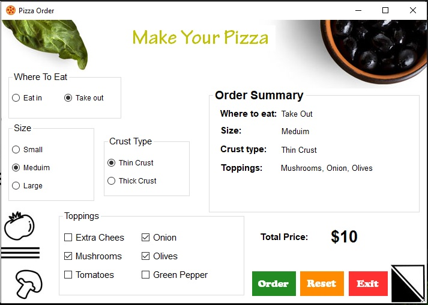

# Pizza Project

* A simple Pizza system built using .NET Forms with C#. This small system allows users to customize and place pizza orders with different toppings, sizes, and crust types.

### Features
* Select pizza size (Small, Medium, Large)
* Choose crust types (Thin, Thick)
* Add toppings (Extra Chees, Mushrooms, Tomatoes, ...)
* Where to eat (Eat in, Take away)
* Calculate total price based on selections.
* Place orders and start again.

---

---

### Installation
1. Clone the repository.
2. Open the project in Visual Studio.
3. Build and run the system.

